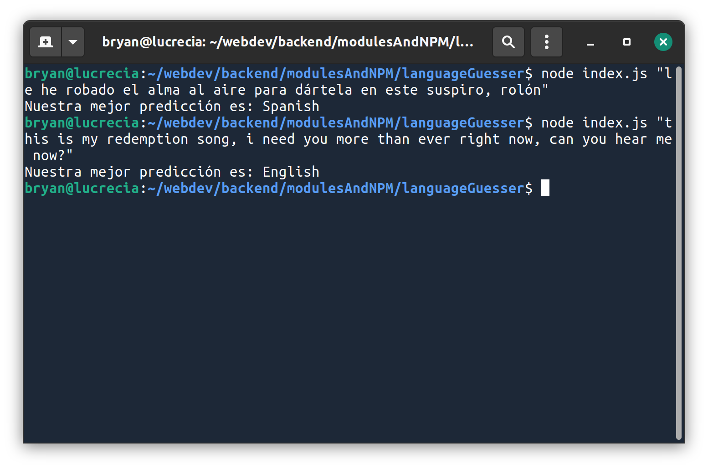

# LANGUAGE GUESSER 🧐

---

This is a node console app. You pass a text of any language as an argument and it'll try to guess that language.

## How to use

After installing all the dependencies (check the package.json file). Run the file as:

```
node index.js "your text, this is an example itself, so you'll expect English as an answer"
```

and in the console it'll show this

```
English
```

